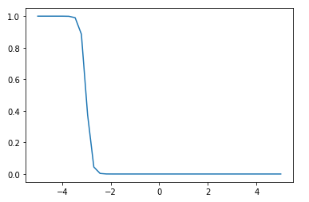

# Probabilistic Programming and Bayesian Methods for Hackers 

-- Recommended on tensorflow_probability home page.

## Introduction to probabilistic ML

[Introduction to PML from Tensorflow](https://blog.tensorflow.org/2018/12/an-introduction-to-probabilistic.html)

Trying to model the probability of o-rings failing on space shuttles. 

```python
import math 
import numpy as np 
import matplotlib.pyplot as plt

def logistic(t, alpha, beta): 
    return 1/(1 + math.exp((beta * t) + alpha))

vector_log = np.vectorize(logistic)

x = np.linspace(-5, 5, 40)
y = vector_log(x, 30, 1)

plt.plot(x, y)
```

With $$\alpha, \beta = 30, 1$$: 


With $$\alpha, \beta = 30, 10$$: 



$\alpha, \beta$ are variables that model the shape and bias (shift left-right) of the logistic function. [Wikipedia page for logistic functions](https://en.wikipedia.org/wiki/Logistic_function). Both of these parameters can be positive or negative and have no specific or clear boundaries, so we can model them as Gaussian random variables: 

$$\alpha = Normal(\mu, \sigma^2)$$


$$\beta = Normal(\mu, \sigma^2)$$

We can then convert this probability of failure at temperature p, $$p(t)$$, to our observed data (which is binary - failure or no failure) using a Bernoulli variable ($D(p)$ takes value 1 with probability p, 0 with $$q = 1 - p$$). 
## The Bayesian state of mind

Suppose you write some code and you believe it works but you are not completely sure. So you write so tests and the code passes. Based on this your confidence in your code improves. However, give that your tests are finite you still are not 100% confident in your code. 

This is your mind performing Bayesian inference. Mathematically your mind has so prior assumption that your code has bugs $$P(\text{bug})$$. You also assign a confidence in your tests, so that the probability a bug slipped through your tests while they still all passed is $$P(\text{passed}|\text{bug})$$. Therefore, the confidence, or posterior, that there is a bug given that all the tests are passed is
$$
P(\text{bug}|\text{passed}) = \frac{P(\text{passed}|\text{bug}) P(\text{bug})}{P(\text{passed})}
$$
The probability that the code passes the test is given by
$$
P(\text{passed}) = P(\text{passed}|\text{bug}) P(\text{bug}) +  P(\text{passed}|\text{ no bug}) P(\text{no bug})
$$
