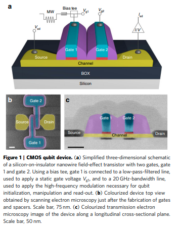

# Notes on Quantum Dots

<!-- toc -->

### [A CMOS silicon spin qubit - Maurand](https://www.nature.com/articles/ncomms13575.pdf)

A paper about a Silicon qubit made with an industry standard fabrication process published in 2016. The device consists of a two gate, p-type transistor with an undoped channel. An example of an accumulation architecture, where gates are used to fill the quantum dots with holes. If there are an off number of holes then the quantum dot as a whole is a spin $$1/2$$ system. 

At low temperatures the first gate defines the quantum dot encoding the hole spin $$1/2$$  qubit. The second dot is used for readout.  All electrical control is demonstrated using phase tunable microwaves applied to the first gate. The microwaves were able to couple to the spin using electric-dipole spin resonance (EDSR). And readout using charge conversion via Pauli spin blockage.  
