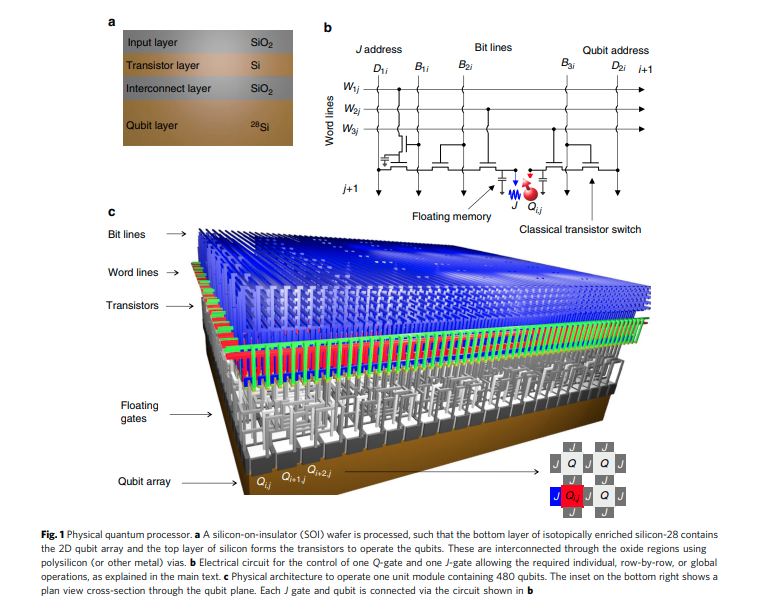

# Notes on fabrication/architecture papers

 <!-- toc -->

### [CMOS architecture for a spin-based quantum computer - Veldhorst](https://www.nature.com/articles/s41467-017-01905-6.pdf)

A paper discussing the how a CMOS architecture for spin-$$1/2$$ qubits might be scaled.  Single qubit gates are implemented using microwave cavity, two qubit gates via exchange interactions and read out by gate based dispersive readout. They suggest how transistor based control circuit with charge storage electrodes could be used to operate a dense and scalable two dimensional qubit system. 

In classical computing Silicon based CMOS integrated circuits (ICs) have scaled to billions of transistors. A key architectural aspect of IC is the parallel addressing through word line and bit line, facilitating  rapid read and write operations on large 2D arrays of bits. Unfortunately, this cannot be applied directly to qubit arrays. As the tolerance levels are small so each qubit must be individually tunable. 

This paper develops an architecture which allows for parallel addressing of silicon spin qubits, while solving the tunability issue through 'floating memory gate electrodes' that can be routinely reset, similar to dynamic random access memory. Their architecture requires $$\mathcal{O}(\sqrt{N})$$ lines for $$N $$ qubits. 

##### Physical Architecture 

The general architecture proposed uses a layered Silicon wafer, where the lowest layer is isotopically enriched silicon-28, to host the qubits. The layers above need not be enriched as they will hold the classical circuitry. The layers are interconnected by metal lines. There will be a singe floating gate for quantum dot definition and another to control the nearest neighbour coupling.  Individual qubit addressing in achieved through a combination of word and bit lines. 

They estimate that if the feature size, ie the minimal width between gates and undoped regions is $$\lambda$$ then the classical control structure will occupy an area $$80 \lambda^{2}$$ above the qubit. A features size of $$\lambda = 7 $$nm, consistent with current AMD consumer processors, leads to a qubit size of $$63 \times 63$$nm. 

##### Readout

There are two popular readout schemes: 

1. Readout based on the Zeeman energy (using a reservoir) 
2. Readout based on singlet-triplet energy using Pauli spin blockade.  They estimate that the Pauli spin blockade energy is about 1meV. 

They favour the spin blockade technique because 

- the larger energy scale leads to a better fidelity 
- it not necessitating for each qubit to be attached to a reservoir
- it does no require a large magnetic field.  

The readout they propose requires a reference dot, which sits in the ground state. They then try to force the dots together and determine the spin dependant charge state using gate based dispersive readout. Thus only half the qubits would be available to be read out.  They suggest extensive multiplexing, but I do not know how feasible it will be. 

##### Heat Dissipation

Of critical importance to large scale quantum computing is heat dissipation/cooling power. They estimate the heat produced by the control electronics and how much heat a cryostat could remove and conclude an operating temperature of $$100$$mK. 

[Barnaby]